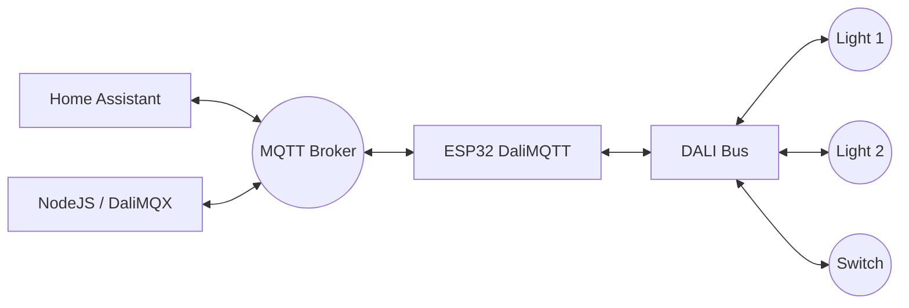

## Architecture

The **DaliMQTT** firmware runs on an ESP32, acting as a bridge between a standard DALI Bus (requires physical DALI Driver circuit) and your MQTT Broker.

### Key Specs
*   **Protocol:** DALI / DALI-2 (Forward & Backward frames)
*   **Control:** Dimming, Groups, Scenes, Broadcast
*   **DT8 Support:** Tunable White (Tc) & RGB (RGBWAF)
*   **Input Devices:** Event monitoring for buttons and sensors (Instance types).
